# System UML Diagrams
> **Multi-Audience Technical Documentation**
> Last Updated: 2026-02-03 (Fixed: Class Diagram enum rendering, User Roles diagram readability)
> Auto-Update Status: ✅ Enabled

---

## 📋 Table of Contents
- [For Business Stakeholders](#for-business-stakeholders)
- [For System Architects](#for-system-architects)
- [For Developers](#for-developers)
- [Diagram Maintenance Guide](#diagram-maintenance-guide)

---

## 🎯 For Business Stakeholders
> **Focus:** User workflows, business processes, and high-level system interactions

### 1. Business Context Diagram
**Purpose:** Shows how the system fits within the healthcare claims ecosystem

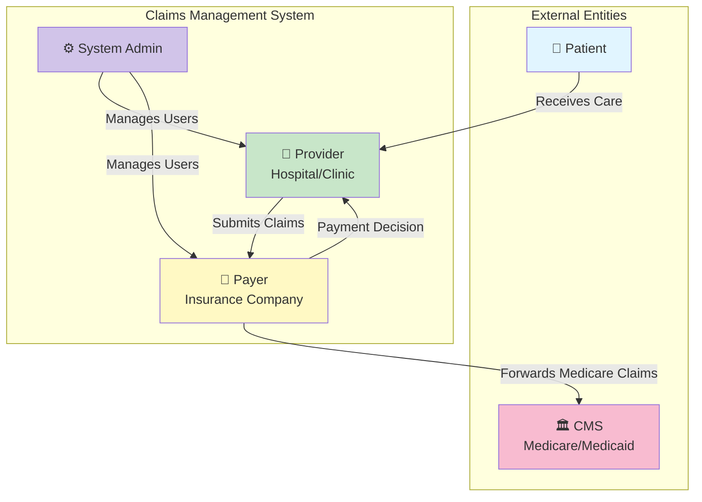

### 2. User Journey - Claims Submission
**Purpose:** End-to-end flow from claim submission to payment decision

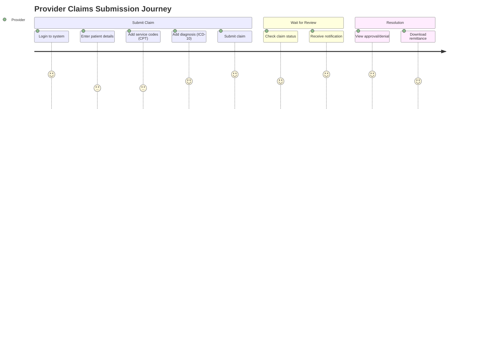

### 3. High-Level Workflow
**Purpose:** Simplified business process showing key decision points

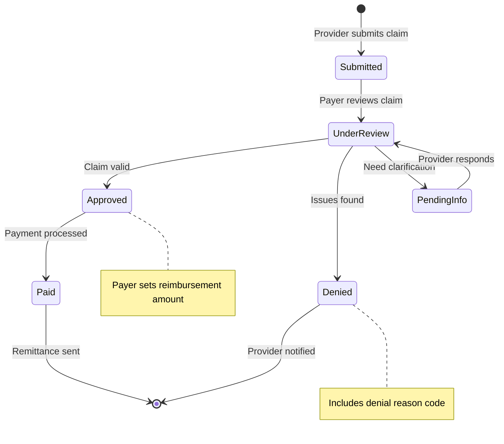

### 4. User Roles & Permissions
**Purpose:** Who can do what in the system

```mermaid
graph TB
    CMS[Claims Management System]

    subgraph "Provider Staff"
        PS1[Submit claims]
        PS2[View own claims]
        PS3[Track status]
        PS4[Download reports]
    end

    subgraph "Payer Claims Processor"
        PP1[View all claims]
        PP2[Approve/Deny claims]
        PP3[Set reimbursement]
        PP4[Add adjudication notes]
    end

    subgraph "System Admin"
        SA1[Provision users]
        SA2[Assign roles]
        SA3[View audit logs]
        SA4[Manage system config]
    end

    subgraph "CMS Proxy User - Future"
        CP1[View forwarded claims]
        CP2[Generate reports]
    end

    CMS --> PS1
    CMS --> PP1
    CMS --> SA1
    CMS -.-> CP1

    style CMS fill:#4CAF50,color:#fff
    style PS1 fill:#c8e6c9
    style PS2 fill:#c8e6c9
    style PS3 fill:#c8e6c9
    style PS4 fill:#c8e6c9
    style PP1 fill:#fff9c4
    style PP2 fill:#fff9c4
    style PP3 fill:#fff9c4
    style PP4 fill:#fff9c4
    style SA1 fill:#d1c4e9
    style SA2 fill:#d1c4e9
    style SA3 fill:#d1c4e9
    style SA4 fill:#d1c4e9
    style CP1 fill:#f8bbd0
    style CP2 fill:#f8bbd0
```

---

## 🏗️ For System Architects
> **Focus:** System design, data flow, infrastructure, and integration patterns

### 1. System Architecture (C4 Model - Level 1)
**Purpose:** Overall system context and external dependencies

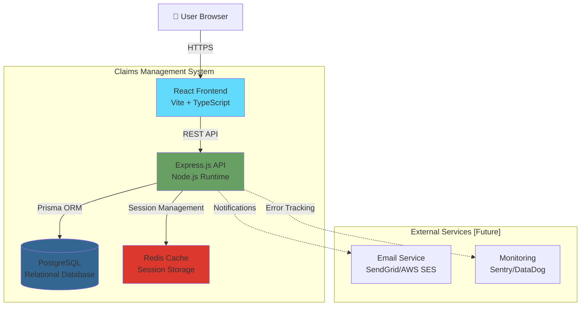

### 2. Component Architecture (C4 Model - Level 2)
**Purpose:** Internal system components and their relationships

```mermaid
graph TB
    subgraph "Frontend Components"
        UI[UI Components<br/>React Components]
        State[State Management<br/>React Context]
        APIClient[API Client<br/>Axios]
    end

    subgraph "Backend Components"
        Routes[API Routes<br/>Express Router]
        Controllers[Controllers<br/>Request Handlers]
        Services[Business Logic<br/>Service Layer]
        Middleware[Middleware<br/>Auth + Validation]
    end

    subgraph "Data Layer"
        Prisma[Prisma ORM<br/>Type-Safe Queries]
        Migrations[Database Migrations<br/>Schema Versioning]
    end

    UI --> State
    State --> APIClient
    APIClient -->|HTTP Requests| Routes
    Routes --> Middleware
    Middleware --> Controllers
    Controllers --> Services
    Services --> Prisma
    Prisma --> Migrations

    style UI fill:#61dafb
    style Services fill:#68a063
    style Prisma fill:#2d3748
```

### 3. Data Flow - Claims Processing
**Purpose:** How data moves through the system during claim lifecycle

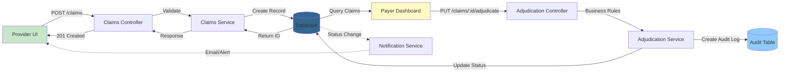

### 4. Deployment Architecture
**Purpose:** Infrastructure and hosting environment

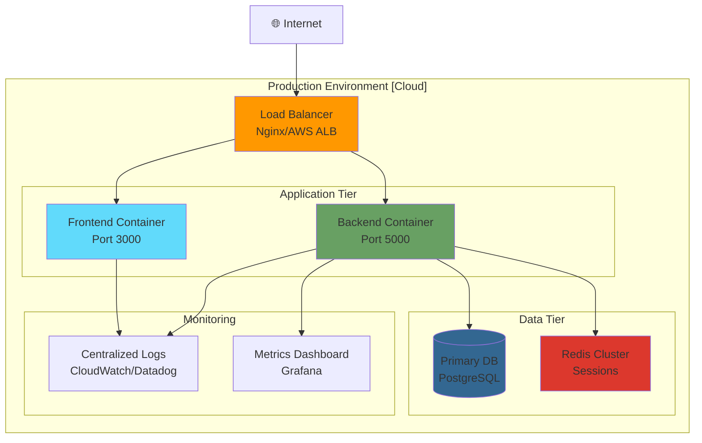

### 5. Security Architecture
**Purpose:** Authentication, authorization, and data protection

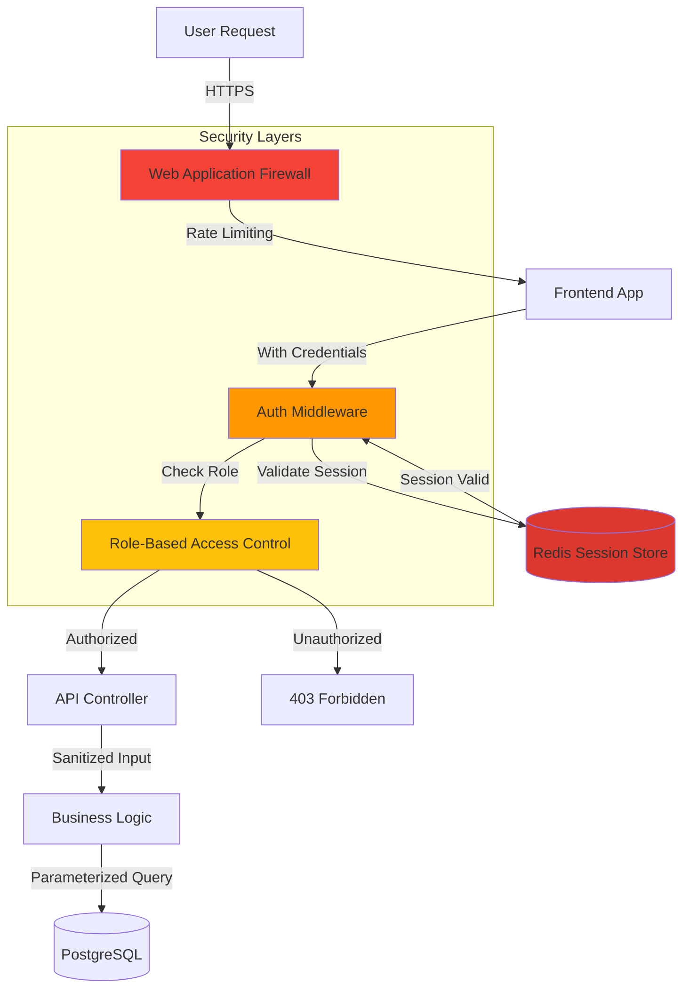

---

## 👨‍💻 For Developers
> **Focus:** Code structure, API flows, database schema, and implementation details

### 1. Class Diagram - Core Domain Models
**Purpose:** Entity relationships and data structure

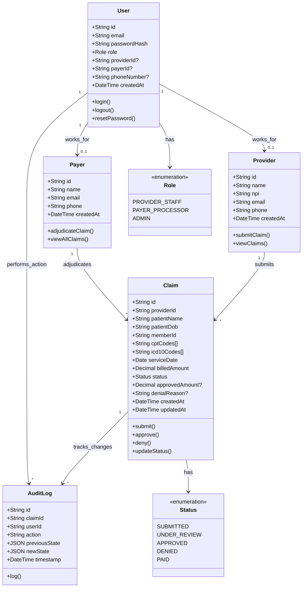

### 2. Sequence Diagram - Claims Submission Flow
**Purpose:** Step-by-step API interaction for submitting a claim

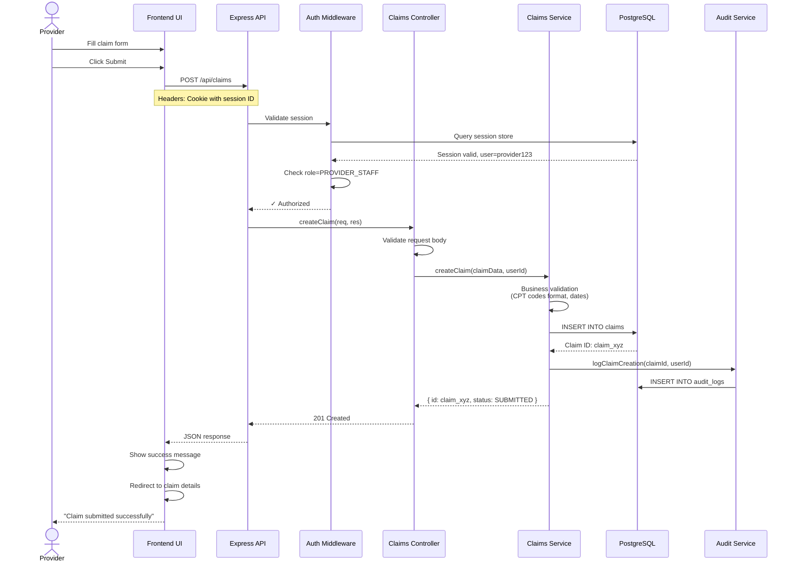

### 3. Sequence Diagram - Claims Adjudication Flow
**Purpose:** Step-by-step API interaction for approving/denying a claim

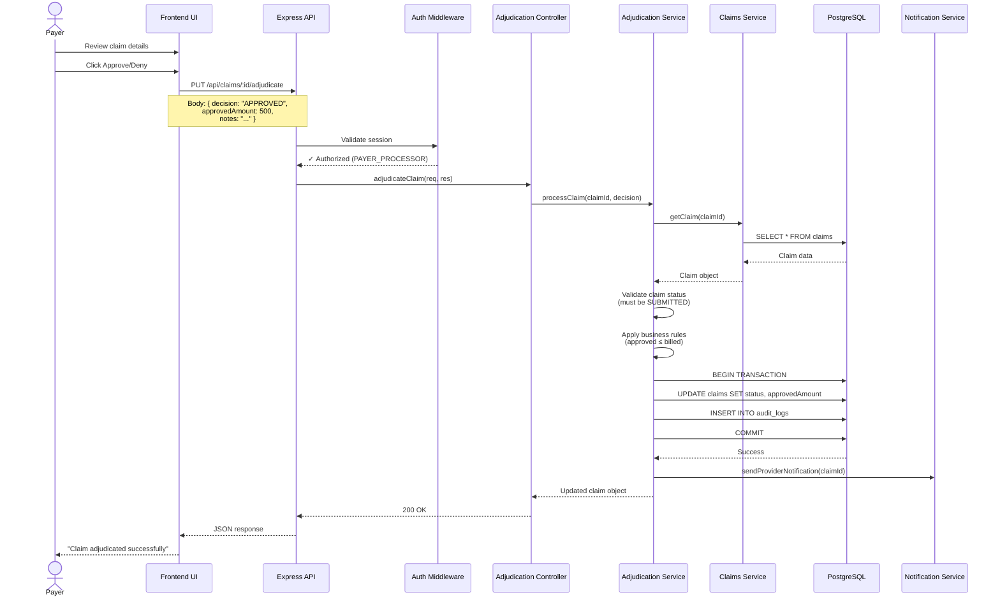

### 4. API Endpoint Map
**Purpose:** Overview of all REST endpoints and their responsibilities

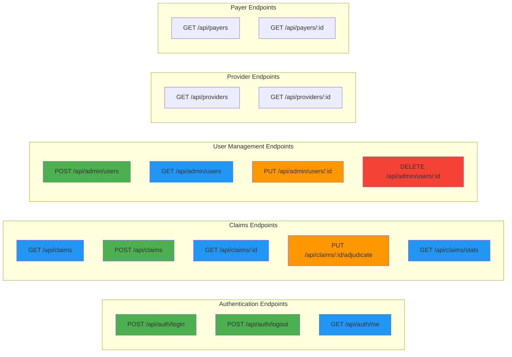

### 5. Database Schema (ERD)
**Purpose:** Complete database structure with relationships and constraints

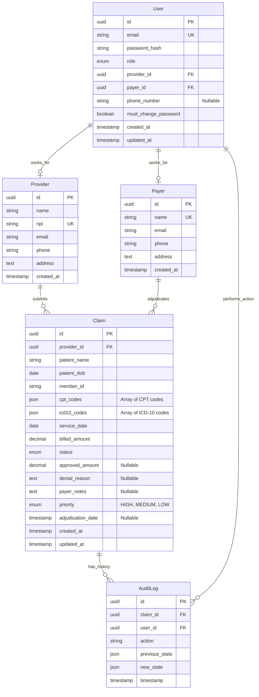

### 6. State Machine - Claim Status Transitions
**Purpose:** Valid state transitions and business rules

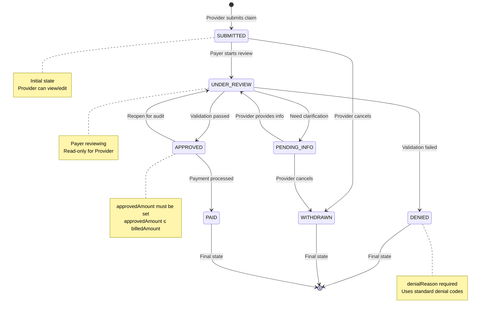

### 7. Component Dependency Graph
**Purpose:** Shows how frontend and backend modules depend on each other

```mermaid
graph TD
    subgraph "Frontend Components"
        Pages[Pages] --> Components[UI Components]
        Pages --> Contexts[React Contexts]
        Pages --> APIClient[API Client]
        Components --> Contexts
        APIClient --> Services[Frontend Services]
    end

    subgraph "Backend Modules"
        Routes[API Routes] --> Middleware[Middleware]
        Routes --> Controllers[Controllers]
        Controllers --> BizServices[Business Services]
        BizServices --> Prisma[Prisma Client]
        Middleware --> Utils[Utilities]
        BizServices --> Utils
    end

    APIClient -->|HTTP| Routes

    style Pages fill:#61dafb
    style Components fill:#61dafb
    style Routes fill:#68a063
    style Controllers fill:#68a063
    style BizServices fill:#68a063
    style Prisma fill:#2d3748
```

---

## 🔧 Diagram Maintenance Guide

### Auto-Update Triggers
This document should be updated when:

| Change Type | Affected Diagrams | Update Required |
|-------------|-------------------|-----------------|
| New API endpoint added | API Endpoint Map, Sequence Diagrams | High Priority |
| Database schema change | ERD, Class Diagram | Critical |
| New user role added | User Roles, Security Architecture | High Priority |
| Status enum modified | State Machine, Class Diagram | Critical |
| New service/component | Component Architecture, Dependency Graph | Medium Priority |
| UI workflow change | User Journey, High-Level Workflow | Medium Priority |

### Manual Update Checklist
Before committing code changes, verify:
- [ ] New entities added to Class Diagram
- [ ] New API endpoints added to API Endpoint Map
- [ ] Database migrations reflected in ERD
- [ ] New business rules added to State Machine
- [ ] Sequence diagrams updated for modified flows

### Automated Monitoring
A git pre-commit hook monitors these files:
- `backend/prisma/schema.prisma` → Triggers ERD update reminder
- `backend/src/routes/*.ts` → Triggers API map update reminder
- `frontend/src/pages/*.tsx` → Triggers workflow update reminder

### How to Update Diagrams
1. **Mermaid Syntax:** All diagrams use [Mermaid](https://mermaid.js.org/) syntax
2. **Live Editor:** Test changes at https://mermaid.live/
3. **Style Guide:** Maintain consistent colors per audience
4. **Version Control:** Commit diagram updates with related code changes

### Diagram Style Guide
- **Business Stakeholders:** Use emojis, simple shapes, minimal technical terms
- **System Architects:** Use standard UML notation, focus on boundaries
- **Developers:** Include technical details, type annotations, constraints

---

## 📊 Diagram Rendering

### Supported Platforms
✅ GitHub (native Mermaid support)
✅ GitLab (native Mermaid support)
✅ VS Code (with Mermaid extension)
✅ Confluence (with Mermaid plugin)
✅ Notion (paste as code block with `mermaid` language)

### Troubleshooting
- **Diagram not rendering?** Check Mermaid syntax at https://mermaid.live/
- **Complex diagram too small?** Add `%%{init: {'theme':'base', 'themeVariables': {'fontSize':'16px'}}}%%` at the top
- **Need to export?** Use Mermaid CLI: `mmdc -i diagram.mmd -o diagram.png`

---

**Document Owner:** System Architecture Team
**Review Frequency:** After every major feature release
**Next Review:** [Date of next sprint planning]
**Questions?** Open an issue or contact the dev team
