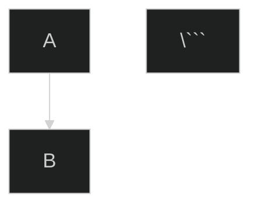

# UML Diagram Maintenance Guide

> **Complete guide for maintaining automated UML diagrams in the Claims Management System**

---

## 📚 Table of Contents
1. [Quick Start](#quick-start)
2. [System Overview](#system-overview)
3. [Installation](#installation)
4. [Daily Workflow](#daily-workflow)
5. [Diagram Update Process](#diagram-update-process)
6. [Automation Tools](#automation-tools)
7. [Configuration](#configuration)
8. [Troubleshooting](#troubleshooting)
9. [Best Practices](#best-practices)

---

## 🚀 Quick Start

### First-Time Setup (5 minutes)

```bash
# 1. Navigate to project root
cd claims-management-system

# 2. Run the setup script to enable git hooks
./scripts/setup-git-hooks.sh

# 3. Verify setup
git config core.hooksPath
# Should output: .githooks

# 4. Test the diagram analysis tool
node scripts/update-uml-diagrams.js --check
```

That's it! The system is now active and will remind you to update diagrams automatically.

---

## 🎯 System Overview

### What This System Does

This UML documentation system provides:

1. **📊 Comprehensive Diagrams**: Multi-audience UML diagrams (business, architects, developers)
2. **🤖 Auto-Detection**: Automatically detects when code changes require diagram updates
3. **🔔 Smart Reminders**: Git hooks remind you to update diagrams before committing
4. **✅ Validation**: Scripts verify diagrams stay in sync with codebase

### Components

```
claims-management-system/
├── docs/
│   ├── SYSTEM_UML_DIAGRAMS.md      # Main diagram file (THE SOURCE OF TRUTH)
│   └── UML_MAINTENANCE_GUIDE.md    # This file
├── scripts/
│   ├── update-uml-diagrams.js      # Diagram analysis tool
│   └── setup-git-hooks.sh          # One-time setup script
├── .githooks/
│   └── pre-commit                  # Git hook for automatic reminders
└── .uml-config.json                # Configuration file
```

---

## 💻 Installation

### Prerequisites

- Node.js (v14 or higher)
- Git
- Text editor with Markdown support (VS Code recommended)

### Step-by-Step Installation

#### 1. Enable Git Hooks

```bash
# Option A: Run the setup script (recommended)
./scripts/setup-git-hooks.sh

# Option B: Manual configuration
git config core.hooksPath .githooks
chmod +x .githooks/pre-commit
```

#### 2. Verify Installation

```bash
# Check git hooks are enabled
git config core.hooksPath
# Expected output: .githooks

# Test the analysis script
node scripts/update-uml-diagrams.js --check
# Should output analysis of current diagrams
```

#### 3. Install VS Code Extensions (Optional but Recommended)

For the best diagram editing experience:

- **Markdown Preview Mermaid Support** - Renders Mermaid diagrams in preview
- **Mermaid Markdown Syntax Highlighting** - Syntax highlighting for diagrams

---

## 📅 Daily Workflow

### How It Works in Practice

#### Scenario 1: You Modify Code (Database Schema)

```bash
# 1. You edit Prisma schema
vim backend/prisma/schema.prisma

# 2. You try to commit
git add backend/prisma/schema.prisma
git commit -m "Add priority field to Claim model"

# 3. Pre-commit hook detects critical file change
# ⚠️  UML DIAGRAM UPDATE REMINDER
# You modified files that may affect UML diagrams:
#   • ERD (Database Schema) - if you changed models/fields
#   • Class Diagram - if you changed entity structure
#
# Options:
#   [c] Check what needs updating
#   [u] Update diagrams now
#   [s] Skip and commit anyway
#   [a] Abort commit

# 4. You choose [c] to see what needs updating
# Script shows detailed analysis and recommendations

# 5. You update the relevant diagrams
vim docs/SYSTEM_UML_DIAGRAMS.md

# 6. Add diagrams to commit and commit again
git add docs/SYSTEM_UML_DIAGRAMS.md
git commit -m "Add priority field to Claim model"
```

#### Scenario 2: You Add a New API Endpoint

```bash
# 1. You add new route
vim backend/src/routes/claims.ts

# 2. Commit triggers reminder
git commit -m "Add GET /claims/stats endpoint"

# 3. Hook reminds you to update:
#   • API Endpoint Map
#   • Sequence Diagrams (if business logic changed)

# 4. You update diagrams and commit together
git add docs/SYSTEM_UML_DIAGRAMS.md backend/src/routes/claims.ts
git commit -m "Add GET /claims/stats endpoint

Updated API Endpoint Map with new stats endpoint"
```

#### Scenario 3: Minor Change (No Diagram Impact)

```bash
# 1. You fix a typo in a React component
vim frontend/src/components/Button.tsx

# 2. Commit proceeds without interruption
git commit -m "Fix typo in button label"
# ✓ No critical files changed. Proceeding with commit.
```

---

## 🔄 Diagram Update Process

### When to Update Diagrams

| Change Type | Diagram to Update | Priority | Time Estimate |
|-------------|-------------------|----------|---------------|
| **Added database model** | ERD, Class Diagram | Critical | 10-15 min |
| **Modified status enum** | State Machine, Class Diagram | Critical | 5-10 min |
| **New API endpoint** | API Endpoint Map | High | 5 min |
| **Changed API flow** | Sequence Diagrams | High | 10-20 min |
| **New user role** | User Roles diagram | Medium | 5 min |
| **UI workflow change** | User Journey, Workflow | Medium | 10-15 min |
| **New component** | Component Architecture | Low | 5-10 min |
| **Infrastructure change** | Deployment Architecture | High | 15-20 min |

### Step-by-Step Update Process

#### Step 1: Analyze What Changed

```bash
# Run the analysis tool
node scripts/update-uml-diagrams.js --interactive

# Output will show:
# - Which files changed
# - Which diagrams are affected
# - Specific recommendations
```

#### Step 2: Open Diagram File

```bash
# Open in your favorite editor
code docs/SYSTEM_UML_DIAGRAMS.md

# Or use vim
vim docs/SYSTEM_UML_DIAGRAMS.md
```

#### Step 3: Locate Relevant Diagrams

Use the table of contents to jump to the right section:
- **Business Stakeholders** - High-level workflows, user journeys
- **System Architects** - Architecture, data flow, infrastructure
- **Developers** - Classes, sequences, API maps, database schema

#### Step 4: Update Mermaid Code

All diagrams use [Mermaid](https://mermaid.js.org/) syntax:

```markdown
### Example: Adding a New API Endpoint

```mermaid
graph LR
    Claims1[GET /api/claims]
    Claims2[POST /api/claims]
    Claims3[GET /api/claims/:id]
    Claims4[PUT /api/claims/:id/adjudicate]
    Claims5[GET /api/claims/stats]  <!-- NEW: Added this line -->

    style Claims5 fill:#2196f3
\```
```

#### Step 5: Preview Your Changes

**Option A: VS Code with Mermaid Extension**
- Open file in VS Code
- Click "Open Preview to the Side" (Ctrl+K V)
- Changes render in real-time

**Option B: Mermaid Live Editor**
- Copy diagram code
- Paste into https://mermaid.live/
- Edit and preview online
- Copy back to your file

**Option C: GitHub Preview**
- Commit and push to GitHub
- View file on GitHub (renders automatically)

#### Step 6: Update Last Modified Date

At the top of `SYSTEM_UML_DIAGRAMS.md`:

```markdown
# System UML Diagrams
> **Multi-Audience Technical Documentation**
> Last Updated: 2026-02-03  <!-- Update this date -->
> Auto-Update Status: ✅ Enabled
```

#### Step 7: Commit Changes

```bash
# Add diagram file to your commit
git add docs/SYSTEM_UML_DIAGRAMS.md

# Commit with descriptive message
git commit -m "Update ERD with new Claim.priority field

- Added priority field to Claim model in ERD
- Updated Class Diagram with enum definition
- Related to: backend/prisma/schema.prisma changes"
```

---

## 🛠️ Automation Tools

### 1. Diagram Analysis Script

**Purpose:** Analyzes codebase and suggests diagram updates

```bash
# Interactive mode (default) - shows checklist and asks if you want suggestions
node scripts/update-uml-diagrams.js

# Check mode - exits with error code if diagrams outdated (good for CI/CD)
node scripts/update-uml-diagrams.js --check

# Update mode - shows what to update (auto-update not yet implemented)
node scripts/update-uml-diagrams.js --update
```

**What It Does:**
- Scans `backend/prisma/schema.prisma` for database models
- Scans `backend/src/routes/` for API endpoints
- Compares file modification times
- Generates update checklist
- Provides specific suggestions

**Example Output:**

```
🎨 UML Diagram Update Tool
============================================================

ℹ️  Analyzing codebase for diagram updates...

ℹ️  Found 5 database models: User, Provider, Payer, Claim, AuditLog
ℹ️  Found 3 enums: Role, Status, Priority
ℹ️  Found 24 API endpoints
ℹ️  Endpoint breakdown: GET:12, POST:6, PUT:4, DELETE:2

📋 DIAGRAM UPDATE CHECKLIST
============================================================

Based on your codebase analysis, please verify:

  ✓ Verify ERD includes all models
  ✓ Check Class Diagram matches Prisma schema
  ✓ Verify State Machine reflects status enums
  ✓ Verify API Endpoint Map is complete
  ✓ Check Sequence Diagrams for new flows

------------------------------------------------------------
Database Schema Changes:
  • Database has 5 models
  • Database has 3 enums

------------------------------------------------------------
API Changes:
  • API has 24 endpoints

============================================================
📄 Diagram File Location:
  /home/user/claims-management-system/docs/SYSTEM_UML_DIAGRAMS.md
============================================================

Would you like to see specific update suggestions? (y/n):
```

### 2. Git Pre-Commit Hook

**Purpose:** Automatically reminds you to update diagrams before committing

**How It Works:**
1. Monitors files you're committing
2. Detects if critical files changed (schema, routes, controllers)
3. Checks if diagram file is also in the commit
4. If not, shows interactive prompt with options

**Bypass Hook (Emergency Only):**

```bash
# Skip the hook (not recommended)
git commit --no-verify -m "Emergency hotfix"

# Use sparingly - you'll need to update diagrams later!
```

**Disable Hook Permanently:**

```bash
# Remove hooks path configuration
git config --unset core.hooksPath

# Or delete the hook file
rm .githooks/pre-commit
```

### 3. Configuration File

**File:** `.uml-config.json`

**Purpose:** Defines which code changes trigger which diagram updates

**Key Sections:**

```json
{
  "updateTriggers": {
    "database": {
      "watchFiles": ["backend/prisma/schema.prisma"],
      "affectedDiagrams": ["ERD", "Class Diagram", "State Machine"]
    },
    "apiRoutes": {
      "watchFiles": ["backend/src/routes/**/*.ts"],
      "affectedDiagrams": ["API Endpoint Map", "Sequence Diagrams"]
    }
  }
}
```

**Customization:**

Edit `.uml-config.json` to add new triggers or modify priorities:

```json
{
  "updateTriggers": {
    "myNewFeature": {
      "description": "My custom feature",
      "watchFiles": ["backend/src/myfeature/**/*"],
      "affectedDiagrams": [
        {
          "name": "My Custom Diagram",
          "section": "For Developers",
          "priority": "high"
        }
      ]
    }
  }
}
```

---

## ⚙️ Configuration

### Customizing Behavior

#### Change Which Files Trigger Updates

Edit `.uml-config.json`:

```json
{
  "updateTriggers": {
    "database": {
      "watchFiles": [
        "backend/prisma/schema.prisma",
        "backend/src/models/**/*.ts"  // Add new pattern
      ]
    }
  }
}
```

#### Modify Git Hook Behavior

Edit `.githooks/pre-commit`:

```bash
# Add new critical files
CRITICAL_FILES=(
  "backend/prisma/schema.prisma"
  "backend/src/routes/"
  "backend/src/your-new-dir/"  # Add your directory
)
```

#### Change Diagram Style

Edit `SYSTEM_UML_DIAGRAMS.md` and customize Mermaid theme:

```markdown


Available themes: `default`, `dark`, `forest`, `neutral`

---

## 🐛 Troubleshooting

### Common Issues

#### Issue 1: Hook Not Running

**Symptom:** Commits go through without diagram reminders

**Solutions:**

```bash
# 1. Verify hooks path is set
git config core.hooksPath
# Should output: .githooks

# 2. Re-run setup
./scripts/setup-git-hooks.sh

# 3. Check hook is executable
ls -la .githooks/pre-commit
# Should show -rwxr-xr-x (x = executable)

# 4. Make executable if needed
chmod +x .githooks/pre-commit
```

#### Issue 2: Diagram Not Rendering

**Symptom:** Mermaid code shows as plain text

**Solutions:**

1. **On GitHub:** Wait a few seconds, refresh page
2. **In VS Code:** Install "Markdown Preview Mermaid Support" extension
3. **Syntax Error:** Check your Mermaid code at https://mermaid.live/

**Common Syntax Errors:**

```mermaid
# ❌ Wrong: Missing quotes
graph TD
    A[Node with spaces that aren't quoted] --> B

# ✅ Correct: Quoted spaces
graph TD
    A["Node with spaces in quotes"] --> B

# ❌ Wrong: Invalid arrow
A => B

# ✅ Correct: Valid arrows
A --> B    (solid)
A -.-> B   (dotted)
A ==> B    (thick)
```

#### Issue 3: Analysis Script Fails

**Symptom:** `node scripts/update-uml-diagrams.js` crashes

**Solutions:**

```bash
# 1. Check Node.js version (need v14+)
node --version

# 2. Check file exists
ls -la scripts/update-uml-diagrams.js

# 3. Run with debug output
node --trace-warnings scripts/update-uml-diagrams.js

# 4. Check file permissions
chmod +x scripts/update-uml-diagrams.js
```

#### Issue 4: Diagrams Out of Sync

**Symptom:** Diagrams don't match current code

**Solutions:**

```bash
# 1. Run full analysis
node scripts/update-uml-diagrams.js --interactive

# 2. Check specific sections
# - Review each diagram mentioned in checklist
# - Compare with actual code

# 3. Update last modified date
# Edit SYSTEM_UML_DIAGRAMS.md and update date at top
```

#### Issue 5: Too Many Warnings

**Symptom:** Hook triggers on every commit, even for minor changes

**Solutions:**

```bash
# Option 1: Adjust sensitivity in .githooks/pre-commit
# Remove directories that trigger too often

# Option 2: Update .uml-config.json
# Set lower priority for certain triggers

# Option 3: Train your team
# Help developers understand when updates are truly needed
```

---

## 💡 Best Practices

### Do's ✅

1. **Update diagrams in the same commit as code changes**
   - Keeps everything in sync
   - Makes code review easier
   - Maintains accurate documentation

2. **Use descriptive commit messages**
   ```bash
   # ✅ Good
   git commit -m "Add claim priority field

   - Updated Prisma schema with priority enum
   - Added priority to Claim model
   - Updated ERD and Class Diagram
   - Updated State Machine with priority transitions"

   # ❌ Bad
   git commit -m "Updated stuff"
   ```

3. **Preview diagrams before committing**
   - Use Mermaid Live Editor: https://mermaid.live/
   - Or VS Code with Mermaid extension
   - Catch syntax errors early

4. **Keep diagrams simple and focused**
   - Each diagram should tell one story
   - Don't overcrowd with details
   - Use notes for clarifications

5. **Follow audience-specific guidelines**
   - Business: Use emojis, simple shapes, avoid jargon
   - Architects: Use standard UML, show boundaries
   - Developers: Include types, annotations, constraints

6. **Run the analysis script regularly**
   ```bash
   # Weekly diagram health check
   node scripts/update-uml-diagrams.js --check
   ```

### Don'ts ❌

1. **Don't skip diagram updates for "small" changes**
   - Small changes accumulate
   - Creates technical debt
   - Makes future updates harder

2. **Don't use `--no-verify` habitually**
   ```bash
   # ❌ Bad habit
   git commit --no-verify -m "Fix bug"  # Every time!

   # ✅ Only for emergencies
   git commit --no-verify -m "HOTFIX: Critical production bug"
   # Remember to update diagrams later!
   ```

3. **Don't create custom diagram formats**
   - Stick to Mermaid syntax
   - Ensures consistency
   - Maintains compatibility

4. **Don't duplicate diagrams**
   - One source of truth: `SYSTEM_UML_DIAGRAMS.md`
   - Don't create separate diagram files
   - Link to main file from other docs

5. **Don't ignore diagram style guide**
   - Consistent colors across diagrams
   - Standard notation per audience
   - See `.uml-config.json` for style definitions

### Team Workflow

#### For Solo Developers

```bash
# 1. Make code change
# 2. Run analysis
node scripts/update-uml-diagrams.js

# 3. Update diagrams
vim docs/SYSTEM_UML_DIAGRAMS.md

# 4. Commit together
git add . && git commit -m "Feature X with updated diagrams"
```

#### For Teams

**During Code Review:**
1. Reviewer checks if diagrams were updated
2. Verify diagrams match code changes
3. Suggest improvements to diagram clarity

**During Sprint Planning:**
1. Review diagram file weekly
2. Identify outdated sections
3. Assign diagram updates as tasks

**Documentation:**
```markdown
## Pull Request Checklist
- [ ] Code changes implemented
- [ ] Tests added/updated
- [ ] UML diagrams updated (if applicable)
- [ ] README updated (if applicable)
```

---

## 📖 Additional Resources

### Mermaid Documentation
- **Official Docs:** https://mermaid.js.org/
- **Live Editor:** https://mermaid.live/
- **Cheat Sheet:** https://jojozhuang.github.io/tutorial/mermaid-cheat-sheet/

### UML Best Practices
- **C4 Model:** https://c4model.com/
- **UML Diagrams:** https://www.uml-diagrams.org/
- **PlantUML (alternative):** https://plantuml.com/

### Tools
- **VS Code Extensions:**
  - Markdown Preview Mermaid Support
  - Mermaid Markdown Syntax Highlighting
- **GitHub Support:** Native Mermaid rendering in `.md` files
- **Mermaid CLI:** `npm install -g @mermaid-js/mermaid-cli`

### Project-Specific
- **Main Diagram File:** [docs/SYSTEM_UML_DIAGRAMS.md](./SYSTEM_UML_DIAGRAMS.md)
- **Configuration:** [.uml-config.json](../.uml-config.json)
- **Analysis Script:** [scripts/update-uml-diagrams.js](../scripts/update-uml-diagrams.js)

---

## 🤝 Getting Help

### Questions?

1. **Check this guide first** - Most answers are here
2. **Run the analysis script** - `node scripts/update-uml-diagrams.js`
3. **Test in Mermaid Live** - https://mermaid.live/
4. **Open an issue** - GitHub Issues for bugs/feature requests

### Contributing

To improve this system:

1. Fork the repository
2. Make your changes
3. Update this guide
4. Submit a pull request

---

## 📋 Quick Reference

### Essential Commands

```bash
# Setup (once)
./scripts/setup-git-hooks.sh

# Check diagrams
node scripts/update-uml-diagrams.js --check

# Interactive analysis
node scripts/update-uml-diagrams.js

# Edit diagrams
vim docs/SYSTEM_UML_DIAGRAMS.md

# Preview (VS Code)
code docs/SYSTEM_UML_DIAGRAMS.md
# Then: Ctrl+K V

# Bypass hook (emergency)
git commit --no-verify -m "Message"

# Disable hooks
git config --unset core.hooksPath
```

### File Locations

| File | Purpose |
|------|---------|
| `docs/SYSTEM_UML_DIAGRAMS.md` | Main diagram file (SOURCE OF TRUTH) |
| `docs/UML_MAINTENANCE_GUIDE.md` | This guide |
| `scripts/update-uml-diagrams.js` | Analysis tool |
| `scripts/setup-git-hooks.sh` | Setup script |
| `.githooks/pre-commit` | Git hook |
| `.uml-config.json` | Configuration |

### Priority Levels

| Priority | Meaning | Action Required |
|----------|---------|-----------------|
| **Critical** | System won't work without update | Update immediately |
| **High** | Important for accuracy | Update before release |
| **Medium** | Nice to have | Update within sprint |
| **Low** | Minor improvements | Update when convenient |

---

**Last Updated:** 2026-02-03
**Maintainer:** Development Team
**Version:** 1.0.0
